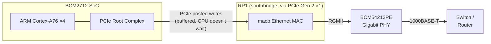
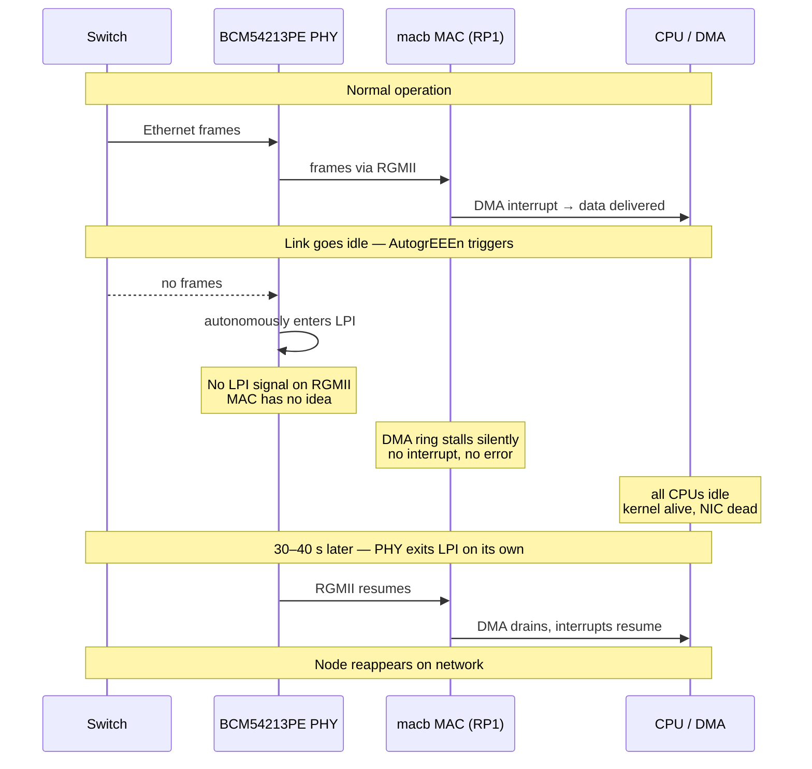
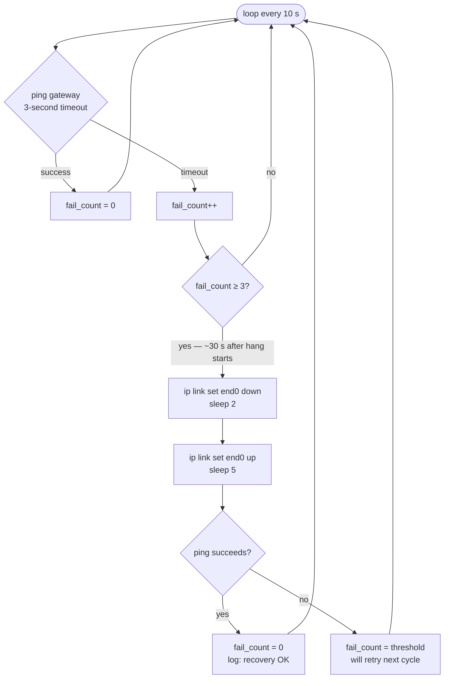
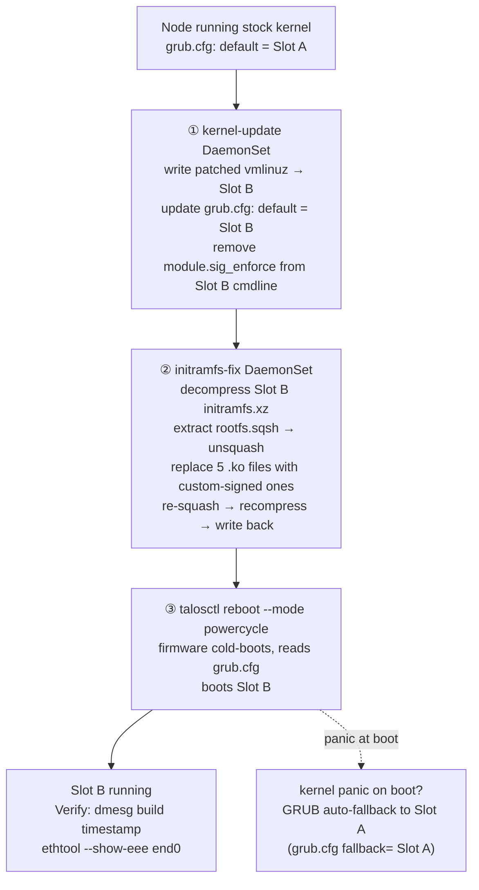
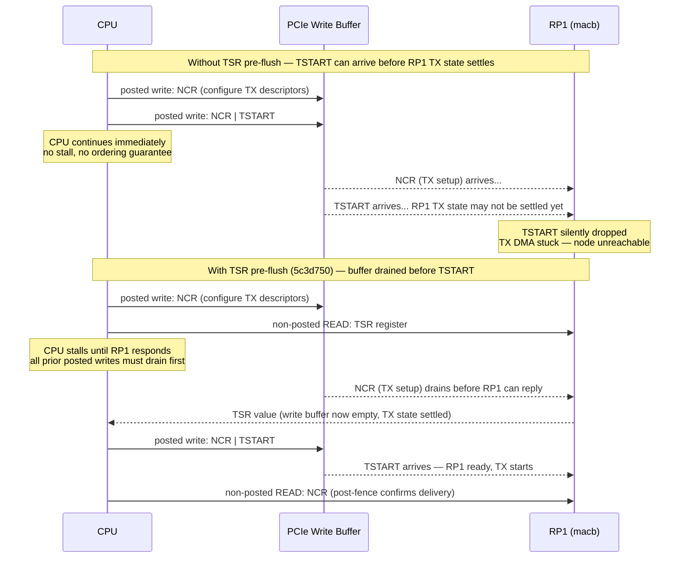

+++
date = '2026-03-23T00:00:00-07:00'
title = 'Silent Network Death on Raspberry Pi 5: Diagnosing and Fixing AutogrEEEn'
description = 'The RPi5 BCM54213PE PHY silently enters EEE Low Power Idle without telling the macb MAC driver, causing complete network blackouts every few minutes. Here is how to confirm it, mitigate it, and fix it with a custom kernel.'
tags = ['raspberry-pi', 'linux', 'kernel', 'networking', 'talos', 'kubernetes', 'homelab', 'longhorn']
draft = false
+++

Raspberry Pi 5 nodes in a Kubernetes cluster go completely silent on the network for 30–40 seconds every 2–3 minutes. No kernel panic. No OOM. All CPUs idle. The `macb` Ethernet driver logs nothing. They just stop, then come back.

This post covers how to confirm whether you're hitting this bug, a DaemonSet-based mitigation that reduces the outage to ~4 seconds, and a custom kernel fix that disables the underlying cause.

**Root cause**: The BCM54213PE PHY uses Broadcom's proprietary *AutogrEEEn* mode — an autonomous EEE Low Power Idle implementation that operates entirely at the PHY layer without informing the MAC. The `macb` driver has no EEE/LPI support, so when the PHY enters low-power idle it hangs silently.

## Is This Your Problem?

First, confirm the kernel is alive during the hang. If you have a serial console connected (GPIO UART on the 40-pin header at 115200 baud), send SysRq `l` during a hang:

```text
echo l > /proc/sysrq-trigger
```

If all four CPUs show idle stacks — not stuck in kernel code — the hardware is hung, not the kernel.

Then check the PHY statistics before and during a hang:

```bash
ethtool --phy-statistics end0
```

```text
PHY statistics:
     phy_receive_errors: 0
     phy_local_rcvr_nok: 14     # <-- this incrementing = AutogrEEEn hang
     phy_remote_rcv_nok: 0
     phy_lpi_count: 0
```

`phy_local_rcvr_nok` incrementing during hangs and otherwise stable is the signature of this bug. Check whether standard EEE is advertised:

```bash
ethtool --show-eee end0
```

If it shows `EEE status: enabled` or lists 1000baseT-Full in the advertised set, standard EEE is active. AutogrEEEn is a separate (worse) problem that persists even with standard EEE disabled via DT properties — the `eee-broken-*` Device Tree fix from [PR #6900](https://github.com/raspberrypi/linux/pull/6900) disables 802.3az advertisement but doesn't touch AutogrEEEn.

## What Is AutogrEEEn?

The RPi5 network stack spans two chips connected by PCIe. The BCM2712 SoC contains the ARM cores; the RP1 "southbridge" chip contains all the I/O including the Ethernet MAC. The PHY sits off the MAC via RGMII, and the switch connects to the PHY. This topology matters because MMIO writes from the CPU to RP1 travel over PCIe as *posted writes* — fire-and-forget transactions that the CPU doesn't wait for.





Standard 802.3az EEE is negotiated between link partners and the MAC controls entry/exit. AutogrEEEn is Broadcom's shortcut: the PHY decides to enter low-power idle autonomously, based on local traffic levels, without any RGMII signaling to the MAC. The MAC has no idea it happened, can't drain or refill the DMA ring, and the NIC becomes a black hole until the PHY decides to come back.

The fix is a patch series by Nicolai Buchwitz (`nb@tipi-net.de`), posted to the Linux netdev mailing list in early March 2026 and accepted into net-next by Jakub Kicinski. It adds proper EEE/LPI support to the `macb` driver for the RP1 MAC and unconditionally clears the AutogrEEEn enable bit in `bcm54xx_config_init()`. The patches target Linux 6.19 (net-next); they haven't been backported to the 6.18.x stable series. Talos v1.12.5 ships Linux 6.18.15, so getting the fix required applying the patches manually to the [siderolabs-pkgs](https://github.com/siderolabs/pkgs) kernel build.

## Immediate Mitigation: netwatch DaemonSet

While waiting for a kernel fix, this DaemonSet polls the default gateway every 10 seconds and toggles the NIC when it fails three consecutive checks. Recovery takes ~4 seconds instead of the natural 30–40 seconds.

Adjust `IFACE` and `GATEWAY` for your environment. On Talos, the Siderolabs tools image provides `ip` and `ping`.

```yaml
apiVersion: apps/v1
kind: DaemonSet
metadata:
  name: netwatch
  namespace: kube-system
spec:
  selector:
    matchLabels:
      app: netwatch
  template:
    metadata:
      labels:
        app: netwatch
    spec:
      hostNetwork: true
      hostPID: true
      tolerations:
        - operator: Exists
      containers:
        - name: netwatch
          image: ghcr.io/siderolabs/tools:v1.12.0-7-g57916cb  # or any image with ip + ping
          command:
            - /bin/sh
            - -c
            - |
              IFACE=end0
              GATEWAY=172.29.51.1   # your default gateway
              CHECK_INTERVAL=10
              FAIL_THRESHOLD=3
              fail_count=0

              log() { echo "$(date -u +%Y-%m-%dT%H:%M:%SZ) netwatch: $*"; }

              recover_nic() {
                log "RECOVERY: toggling $IFACE down/up"
                ip link set $IFACE down
                sleep 2
                ip link set $IFACE up
                sleep 5
                if ping -c 1 -W 3 $GATEWAY >/dev/null 2>&1; then
                  log "RECOVERY: success"
                  fail_count=0
                else
                  log "RECOVERY: failed, will retry"
                  fail_count=$FAIL_THRESHOLD
                fi
              }

              while true; do
                if ping -c 1 -W 3 $GATEWAY >/dev/null 2>&1; then
                  fail_count=0
                else
                  fail_count=$((fail_count + 1))
                  log "FAIL $fail_count/$FAIL_THRESHOLD"
                  if [ $fail_count -ge $FAIL_THRESHOLD ]; then
                    recover_nic
                  fi
                fi
                sleep $CHECK_INTERVAL
              done
          securityContext:
            privileged: true
            capabilities:
              add: [NET_ADMIN]
          volumeMounts:
            - name: sys
              mountPath: /sys
              readOnly: true
      volumes:
        - name: sys
          hostPath:
            path: /sys
```

The DaemonSet recovery cycle looks like this:



## The Kernel Fix

The AutogrEEEn disable lives in `drivers/net/phy/broadcom.c`. The key change in patch 0006 is a single register write added to `bcm54xx_config_init()` — the generic BCM54xx init that runs for all PHYs in the family:

```c
/* Disable AutogrEEEn and switch to Native EEE mode so the MAC
 * can control LPI signaling and observe RX LPI on the RGMII
 * interface.
 */
err = bcm_phy_modify_exp(phydev, BCM54XX_TOP_MISC_MII_BUF_CNTL0,
                         BCM54XX_MII_BUF_CNTL0_AUTOGREEEN_EN, 0);
if (err)
    return err;
```

`BCM54XX_MII_BUF_CNTL0_AUTOGREEEN_EN` is bit 0 of the `MII_BUF_CNTL_0` expansion register. Clearing it switches the PHY from autonomous AutogrEEEn to Native EEE mode where the MAC drives LPI signaling.

After applying the fix:

```bash
ethtool --show-eee end0
# EEE status: not supported   ← AutogrEEEn disabled, no LPI negotiated

ethtool --phy-statistics end0
# phy_lpi_count: 0             ← no LPI transitions
# phy_local_rcvr_nok: 17       ← stable between hangs, increments only during events
```

### Building the Kernel on macOS

**Use Colima, not Docker Desktop.** Docker Desktop on macOS produces `arm64` binaries that differ from the Linux `aarch64` environment Talos uses for CI. The resulting kernel boots, but triggers an `SError` fault at `brcmstb_pull_config_set` during `brcmuart_init`. That fault corrupts both GRUB boot slots and requires a full SD card reflash. Colima uses Apple's Virtualization Framework to run a real Linux VM:

```bash
brew install colima
colima start --arch aarch64 --cpu 8 --memory 16 --disk 60 --vm-type vz
```

The siderolabs-pkgs `Pkgfile` sets `linux_version: 6.18.15`. The patches drop into `kernel/build/patches/eee/` of a [fork of siderolabs/pkgs](https://github.com/geoffdavis/siderolabs-pkgs):

| Patch | Upstream status | Description                                                                                  |
|-------|-----------------|----------------------------------------------------------------------------------------------|
| 0001  | net-next (6.19) | macb: add EEE LPI statistics counters                                                        |
| 0002  | net-next (6.19) | macb: implement EEE TX LPI support                                                           |
| 0003  | net-next (6.19) | macb: add ethtool EEE support                                                                |
| 0004  | net-next (6.19) | macb: enable EEE for Raspberry Pi RP1                                                        |
| 0005  | local           | macb: add TSR pre-flush before TSTART on RP1 (based on rpi-6.12.y commit e45c98d)           |
| 0006  | not yet merged  | broadcom: disable AutogrEEEn mode on BCM54xx                                                 |

Patches 0001–0004 are a backport of the Buchwitz net-next series (signed off by Jakub Kicinski and queued for Linux 6.19), incorporating RPi Foundation refinements from [rpi-6.18.y PR #7270](https://github.com/raspberrypi/linux/pull/7270). They haven't been backported to the 6.18.x stable series. Patch 0006 applies cleanly to 6.18.15 and its AutogrEEEn disable runs via the generic `bcm54xx_config_init()` path. Patch 0005 is a local addition; it is described in detail in the updates below.

### Deploying Without `talosctl upgrade`

On Talos RPi5, `talosctl upgrade` crashes at phase 9 because `efivarfs` is mounted read-only — the installer can't write the EFI boot variable ([siderolabs/talos#11844](https://github.com/siderolabs/talos/issues/11844)). The workaround is writing the kernel directly to the inactive GRUB boot slot.

The boot partition is XFS on `mmcblk0p3`. GRUB manages two slots, `A/` and `B/`, each with `vmlinuz` and `initramfs.xz`. The active slot is set in `grub.cfg`:

```text
set default="A - Talos v1.12.5"
set fallback="B - Talos v1.12.5"
```

A privileged DaemonSet reads the current `grub.cfg`, determines the inactive slot, writes the new `vmlinuz`, updates `grub.cfg` to set it as default (keeping the current slot as fallback), and exits. The old slot acts as automatic rollback if the new kernel panics on boot.



**Critical**: use `talosctl reboot --mode powercycle`, not a standard reboot. `talosctl reboot` uses kexec by default, which chains to the new kernel without re-reading GRUB — your slot change is bypassed.

### Module Signatures

Talos builds its kernel with `CONFIG_MODULE_SIG=y`. The initramfs contains `.ko` files signed with Talos's official key. A custom-built kernel has a different signing key, so all RPi5-specific modules will be rejected on load.

The initramfs is a multi-section CPIO archive (several sections concatenated) compressed with zstd. One section contains `rootfs.sqsh` — a SquashFS image holding the kernel modules. To replace the five RPi5 modules with ones signed by the custom build key:

```text
initramfs.xz
  └── CPIO archive (multiple sections)
        ├── section 0: microcode / early init
        └── section N: rootfs.sqsh  (SquashFS)
                          └── /usr/lib/modules/6.18.15-talos/kernel/
                                ├── drivers/irqchip/irq-bcm2712-mip.ko
                                ├── drivers/nvme/host/nvme.ko
                                ├── drivers/mmc/host/sdhci-brcmstb.ko
                                ├── drivers/mmc/host/sdhci-pltfm.ko
                                └── net/tls/tls.ko
```

The repair DaemonSet:

1. Decompresses the initramfs with `zstdcat`
2. Splits the CPIO blob by scanning for `070701` magic at section boundaries
3. Extracts `rootfs.sqsh` from the relevant section via `cpio -id`
4. Unsquashes it with `unsquashfs`, replaces the five `.ko` files, re-squashes with `mksquashfs -comp zstd`
5. Rebuilds the CPIO section with `find . | cpio -o -H newc`
6. Recompresses everything with `zstd -19 -T0`

The CPIO section-split heuristic (looking for `070701` magic at offsets more than 1000 bytes from the previous one) is a bit fragile — it works for the Talos initramfs structure but you'd want to test it on any future kernel version before deploying. A proper split would parse the CPIO headers to find `TRAILER!!!` markers between sections.

## Verification

After powercycle, confirm on each node:

```bash
# Kernel version
cat /proc/version
# Linux version 6.18.15-talos ...

# AutogrEEEn disabled
ethtool --show-eee end0
# EEE status: not supported

# No LPI transitions
ethtool --phy-statistics end0
# phy_lpi_count: 0

# PHY driver loaded (with patch 0005 active, now shows BCM54213PE)
dmesg | grep 'PHY.*driver'
# macb ... PHY [...]  driver [Broadcom BCM54213PE] (irq=POLL)
```

**Important caveat: the hangs are not gone.** `phy_local_rcvr_nok` still increments. With patches 0001–0004 and 0006 alone, hang frequency dropped from every 2–3 minutes to every 2–15 minutes, and netwatch shrinks each outage from 30–40 seconds to ~4 seconds. That's a meaningful improvement — Longhorn volume engines that were timing out during 30-second outages now survive the brief ones — but the root cause is not fully resolved.

**Update (2026-03-24):** Patch 0005 has now been applied on all three nodes (kernel built from siderolabs-pkgs commit `5e57070`). The PHY now binds to `driver [Broadcom BCM54213PE]` instead of `[Broadcom BCM54210E]`, confirming `bcm54213pe_config_init()` is running at PHY probe.

After a few hours of runtime with all 6 patches active, hang frequency is **roughly unchanged** from the patches-0001–0004+0006 baseline. Each node saw a hang every 3–26 minutes (average ~8–15 min), with netwatch recovering each one in ~4 seconds. For comparison:

| Metric          | Pre-kernel (stock) | Patches 0001–0004+0006 | All 6 patches (0005 added) |
|-----------------|--------------------|------------------------|----------------------------|
| Hang frequency  | every 2–3 min      | every 2–15 min         | every 3–26 min             |
| Outage duration | 30–40 s            | ~4 s (netwatch)        | ~4 s (netwatch)            |

Patch 0005 ensures BCM54213PE gets correct per-PHY init (RGMII clock delay, etc.) but doesn't change the AutogrEEEn behavior — that's still patch 0006's job. The hangs are fundamentally a macb/RP1 issue; the patches disable AutogrEEEn but the occasional `phy_local_rcvr_nok` increment suggests the PHY or link partner still triggers something the MAC can't recover from without a link toggle.

There's also a secondary consequence: `kernel.panic_on_rcu_stall=1` fires during some hangs. When the RP1 DMA stalls, the kernel's RCU grace period watchdog detects a stall and panics. With `kernel.panic=10`, the node reboots itself about 45 seconds later and rejoins the cluster. This is survivable — and arguably better than a silent hung node — but it's not a stable final state. Consider whether `kernel.panic_on_rcu_stall` is appropriate for your setup until the underlying hang is fully fixed.

**Update (2026-03-25, commit `c10b497`):** The EEE patch set was replaced with a more complete backport of the RPi Foundation's [rpi-6.18.y PR #7270](https://github.com/raspberrypi/linux/pull/7270), applied via the [geoffdavis/siderolabs-pkgs](https://github.com/geoffdavis/siderolabs-pkgs) fork (`kernel/build/patches/eee/`). Patches 0001–0004 now track the RPi Foundation's implementation rather than the standalone Buchwitz net-next submission, and include fixes that didn't make it into the net-next v6 posting.

After a day of monitoring, hang frequency dropped slightly compared to the all-6-patches baseline, but more importantly the hang pattern became clearly **traffic-dependent**: the Prometheus node (`.13`) was hanging roughly twice as often as the other two nodes. Prometheus generates sustained high TX load (metric scrape responses) while the other nodes are mostly idle. AutogrEEEn is triggered by *idle* traffic — it fires when the PHY sees no frames to send. A hang rate that scales with TX load points away from AutogrEEEn and toward a different mechanism: **TSTART stalls**.

The `macb` driver issues TSTART (transmit start) via a posted PCIe write to the RP1 NCR register. Posted writes are buffered — they can sit in the CPU write buffer and be reordered or coalesced before reaching RP1. If RP1 sees TSTART before its internal TX state is stable (e.g., it's still processing a prior NCR write), it may silently drop the TSTART command and leave TX stuck. The existing NCR post-fence (a non-posted `readl()` after the TSTART write) ensures the write eventually arrives — but it doesn't ensure RP1 is *ready* to process it when it does.



**Update (2026-03-25, commit `5c3d750`):** Added patch 0005 — a TSR pre-flush — to address the TSTART stall hypothesis. The fix mirrors [rpi-6.12.y commit e45c98d](https://github.com/raspberrypi/linux/commit/e45c98decbb16e58a79c7ec6fbe4374320e814f1) from the RPi Foundation:

```c
/* Pre-flush: non-posted TSR read serializes all prior posted writes to
 * RP1 before TSTART. Mirrors rpi-6.12.y commit e45c98d. */
(void)macb_readl(bp, TSR);
macb_writel(bp, NCR, macb_readl(bp, NCR) | MACB_BIT(TSTART));
/* RP1 is behind PCIe; posted TSTART writes can be silently dropped.
 * readl() (non-relaxed) includes DSB on arm64 — the CPU stalls until
 * the PCIe non-posted read completes, fencing TSTART to RP1. */
(void)readl(bp->regs + MACB_NCR);
```

The TSR register read is a non-posted PCIe transaction — the CPU stalls until RP1 responds, which drains all prior posted writes (NCR, TSR, ring descriptor updates) from the CPU's write buffer before TSTART is issued. RP1 sees a fully stable TX state before the transmit-start command arrives. Combined with the NCR post-fence, this gives defense-in-depth:

1. **TSR pre-flush**: drain prior posted writes — RP1 TX state stable *before* TSTART
2. **NCR post-fence**: confirm TSTART write delivery — CPU stalls until RP1 acknowledges

Both `macb_tx_restart()` (NAPI-driven TX retry) and `macb_start_xmit()` (per-packet TX) were updated. The patch is applied in `kernel/build/patches/eee/net-macb-rp1-0005-tsr-preflush.patch` of the [geoffdavis/siderolabs-pkgs](https://github.com/geoffdavis/siderolabs-pkgs) fork.

All three nodes were deployed to commit `5c3d750` on 2026-03-25 via the privileged DaemonSet method. Monitoring is ongoing — the key question is whether the TSR pre-flush eliminates the traffic-dependent hang pattern seen with `c10b497`.

## Secondary Consequences: VIP Migration and etcd Churn

The 4-second netwatch recovery looks acceptable in isolation, but it has cascading effects on Talos cluster internals that make it worse in practice.

**VIP migration on every hang.** Talos manages the control plane virtual IP (172.29.51.10) via a Raft-based election among the control plane nodes. When a node loses its link, Talos immediately removes the VIP from that node and re-runs the election. The new winner sends a gratuitous ARP and claims the address. During the handoff, the API server is unreachable — requests get `no route to host` or `connection reset`. From etcd logs:

```text
14:26:57  .13 Link Down
14:26:57  .13 → "removing shared IP 172.29.51.10"
14:27:07  .13 → "removed address 172.29.51.10/32 from end0"
14:27:25  .12 → "sent gratuitous ARP 172.29.51.10"  ← .12 wins the election
```

**etcd leader elections on every hang.** etcd's default election timeout is 1000ms. A 4-second hang triggers multiple failed pre-vote rounds and eventually a full leader change:

```text
14:28:35  .11 Link Down
14:28:32  .11 starts pre-vote elections (can't reach .12 or .13)
14:28:45  .11 became follower; .13 elected leader at term 1030
14:29:43  leader changes again
14:30:52  .13 lost leader, re-elects itself at term 1032
14:35:51  .13 becomes follower again; .11 elected leader at term 1033
```

Each hang produces a burst of etcd term increments and leader churning that lasts well beyond the 4-second link outage. The etcd term counter advanced from 1029 to 1033 in roughly 7 minutes of operation, entirely from hangs.

## Paths to a Real Fix

**RTL8156B USB Ethernet (immediate hardware fix).** The cleanest solution is a USB 2.5GbE adapter using the `r8152` driver. It bypasses the RP1 southbridge, the macb driver, and the BCM54213PE PHY entirely — routing traffic through the BCM2712 SoC's xHCI controller instead. There are no EEE issues with the r8152 stack on RPi5. Configure the USB interface as primary and set `ignore: true` on `end0` in the Talos machine config. (See the USB Ethernet section in the accompanying ops docs.) This doesn't fix the root cause but eliminates the symptom completely.

**etcd election timeout tuning (partial mitigation, can do now).** Increasing the etcd election timeout prevents leader churn on short hangs. With a 5000ms election timeout and 500ms heartbeat, a 4-second link outage falls below the election threshold and etcd rides through it without churning:

```yaml
cluster:
  etcd:
    extraArgs:
      election-timeout: "5000"
      heartbeat-interval: "500"
```

This doesn't prevent the VIP from migrating (that's a separate Talos mechanism), but it eliminates the etcd term increment storm. Trade-off: genuine node failures take longer to trigger a new election. On a stable LAN cluster where nodes self-recover, this is usually acceptable.

**Talos VIP debounce (feature request).** There's currently no built-in link-flap grace period in the Talos VIP operator. A short debounce (say, 10 seconds before removing the VIP on link-down) would prevent VIP migration for hangs shorter than the debounce window. This would need a PR to [siderolabs/talos](https://github.com/siderolabs/talos). There's no existing issue tracking this as of March 2026.

**Upstream kernel (status as of 2026-03-25).** The Buchwitz net-next patch series (v6, submitted 2026-03-06) forms the basis of patches 0001–0004 + 0006. Waiting for Linux 6.20 to ship those patches won't fix the hangs — it just removes the need to carry them out-of-tree.

Commit `c10b497` in [geoffdavis/siderolabs-pkgs](https://github.com/geoffdavis/siderolabs-pkgs) applied the full RPi Foundation [rpi-6.18.y PR #7270](https://github.com/raspberrypi/linux/pull/7270) backport (11 files, merged 2026-03-10). The result: hangs continued at the same frequency. PR #7270's additional changes beyond the Buchwitz series are not the missing piece.

The remaining hangs appear to be TSTART stalls rather than AutogrEEEn, based on the traffic-dependent pattern observed with `c10b497`. Commit `5c3d750` adds the TSR pre-flush (patch 0005) as a targeted fix for that mechanism. Results are pending. `phy_local_rcvr_nok` still increments — that counter reflects PHY receiver errors including link-training transients from the netwatch toggle, not necessarily ongoing EEE.

The honest state of things: the patches reduce hang frequency significantly (from every 2–3 min to every 3–26 min), netwatch keeps each hang to ~4 seconds, and the TSR pre-flush may further reduce frequency. But the underlying cause is not fully resolved. The RTL8156B bypass remains the most reliable path to a stable cluster right now.

## Bonus: Repairing Corrupted Longhorn Snapshot Metadata

While power-cycling nodes, a Longhorn volume went `faulted`. The replica process was crashing immediately on Open — which turned out to be an empty `.img.meta` file, probably zeroed during a hang-interrupted write.

Longhorn snapshot metadata files are JSON:

```json
{
  "Name": "volume-snap-<uuid>.img",
  "Parent": "volume-snap-<parent-uuid>.img",
  "Removed": false,
  "UserCreated": false,
  "Created": "2026-03-23T20:00:00Z",
  "Labels": null
}
```

The dangerous part is the `Parent` field — it must point to a file that actually exists in the replica directory. List the directory, check `volume.meta` for the head filename and its chain, and follow the `.img.meta` files backward until you find the broken one:

```bash
# exec into the instance-manager pod on the replica's node
kubectl exec -n longhorn-system <instance-manager-pod> -- \
  ls /host/var/mnt/longhorn/replicas/<volume-id>/

# read the chain
kubectl exec -n longhorn-system <instance-manager-pod> -- \
  cat /host/var/mnt/longhorn/replicas/<volume-id>/volume.meta
# {"Head":"volume-head-007.img","Parent":"","..."}

kubectl exec -n longhorn-system <instance-manager-pod> -- \
  cat /host/var/mnt/longhorn/replicas/<volume-id>/volume-head-007.img.meta
# {"Parent":"volume-snap-<uuid>.img", ...}
```

If a `.meta` file is empty (0 bytes) or the referenced parent doesn't exist in the directory, reconstruct it. If the parent file was GC'd and no longer exists, set `"Parent": ""` to make the snapshot the new chain root — Longhorn will have coalesced the parent's data into this snapshot before deleting it.

Write the repair with Python to avoid shell quoting issues with `false`/`true`:

```bash
kubectl exec -n longhorn-system <instance-manager-pod> -- python3 -c "
import json
meta = {
  'Name': 'volume-snap-<uuid>.img',
  'Parent': '',
  'Removed': False,
  'UserCreated': False,
  'Created': '2026-03-23T20:00:00Z',
  'Labels': None
}
json.dump(meta, open('/host/var/mnt/longhorn/replicas/<volume-id>/volume-snap-<uuid>.img.meta', 'w'))
"
```

After writing, Longhorn's auto-salvage loop will pick it up within a minute, open the replica successfully, run GC on any remaining removed snapshots, and transition the volume from `faulted` to `degraded` (then to `healthy` once it rebuilds the missing replica on another node).

One catch: Longhorn's GC runs immediately on first successful open and may delete parent snapshots. If the repair needs to be done again after a second fault, re-read the directory — the chain will have changed.

---

The kernel patches live in the [geoffdavis/siderolabs-pkgs](https://github.com/geoffdavis/siderolabs-pkgs) fork under `kernel/build/patches/eee/`. The DaemonSet manifests and full build notes are in [pi-talos-home-ops](https://github.com/geoffdavis/pi-talos-home-ops).
